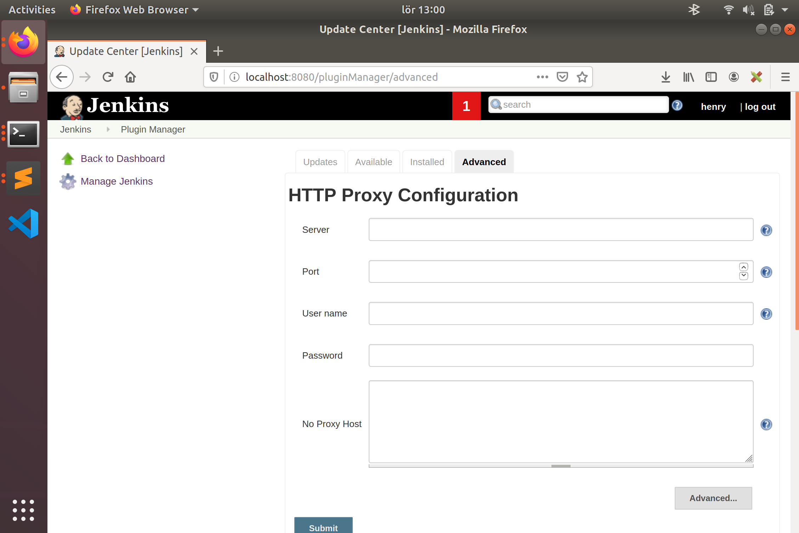
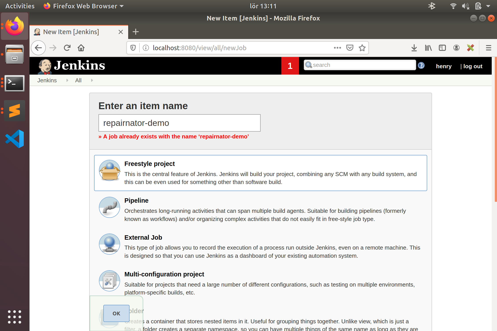

# Repairnator Jenkins Plugin

## How to install ?

Either download the `hpi` file from our snapshot repo or compile one yourself by the cmds below

```
cd repairnator/repairnator-jenkins-plugin
mvn install -DskipTests
```

The hpi is in the `target/` folder if everything went well. Then in Jenkins server `Manage Jenkins -> Manage Plugins -> Advanced` and at the `Upload plugin` section you can upload the `hpi` file to install our plugin (also restart the server when done installing for the update to take effect in some cases). You should be on the page below if the steps were followed correctly.




## How to use the plugin ?

For a freestyle job, it is recommended to use the plugin with Jenkins `Github Pull Request builder`,[link](https://wiki.jenkins.io/display/JENKINS/GitHub+pull+request+builder+plugin) - to activate build upon git pull request or the usual GitHub plugin. To conditionally only activate Repairnator post build upon fail for instance, use a plugin wrapper called `flexible publish pluggin` , [link](https://wiki.jenkins.io/display/JENKINS/Flexible+Publish+Plugin), which easily can handle various build conditions to activate postbuild. Thereafter we can now configure repairnator plugin for a freestyle job and down here is a minimal demo how to use repairnator as a stand alone instance.

* Create a free style job



* Then go to `configure` and add `run repairnator` as post build action


* Since we run repairnator as a stand-alone, we need to specify Git Url and Git branch by expanding the advance option after choosing the default tool `NPEFix`. For repairnator to make a PR back to the repo when patches are found, a git token with enough priviledges need to be provided.


* Add git url and git branch , then click on save


* Then click `Build now` to start building. You should see a log similar to this one below.


Important: When using repairnator together with GitHub PR builder or the usual Github , the advance option can be left empty as the repairnator plugin will use enviroment variables provided instead. 

## For devs, Architecture: quick look

Repairnator Jenkins plugin import the usual `repairnator-pipeline` code as a maven dependency, so most of the features of the usual repairnator can be reused without any great change. The general workflow of the plugin itself is like this, html page (from `.jelly` code) -> plugin get values from form fields -> Error check , if nothing wrong create a `RunPipelineAction` class to run the pipeline with `JenkinsLauncher` class as a special entry point for repairnator when using in Jenkins context.  
