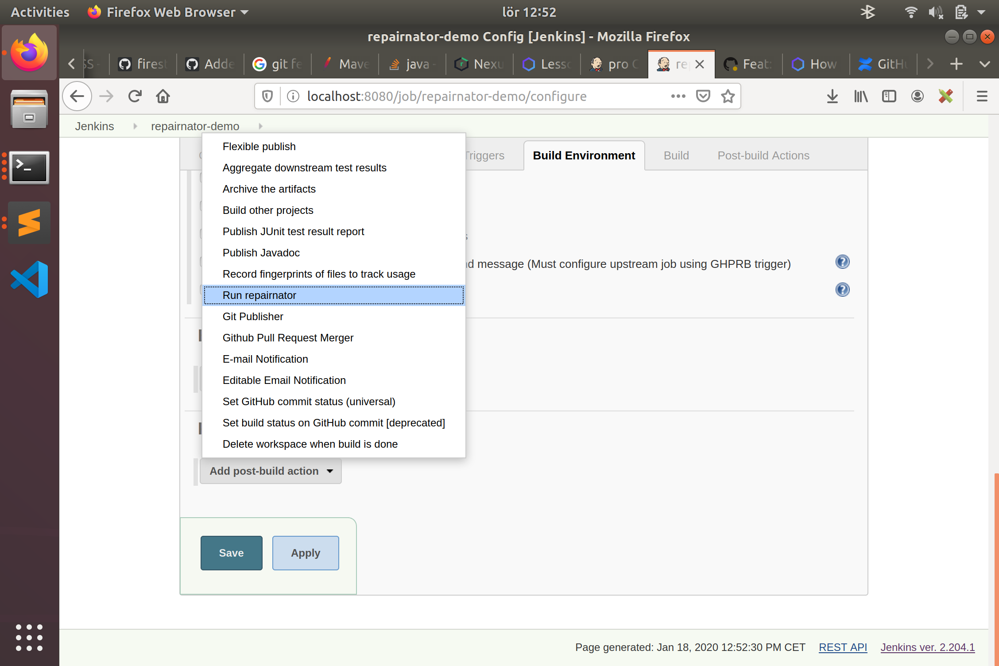
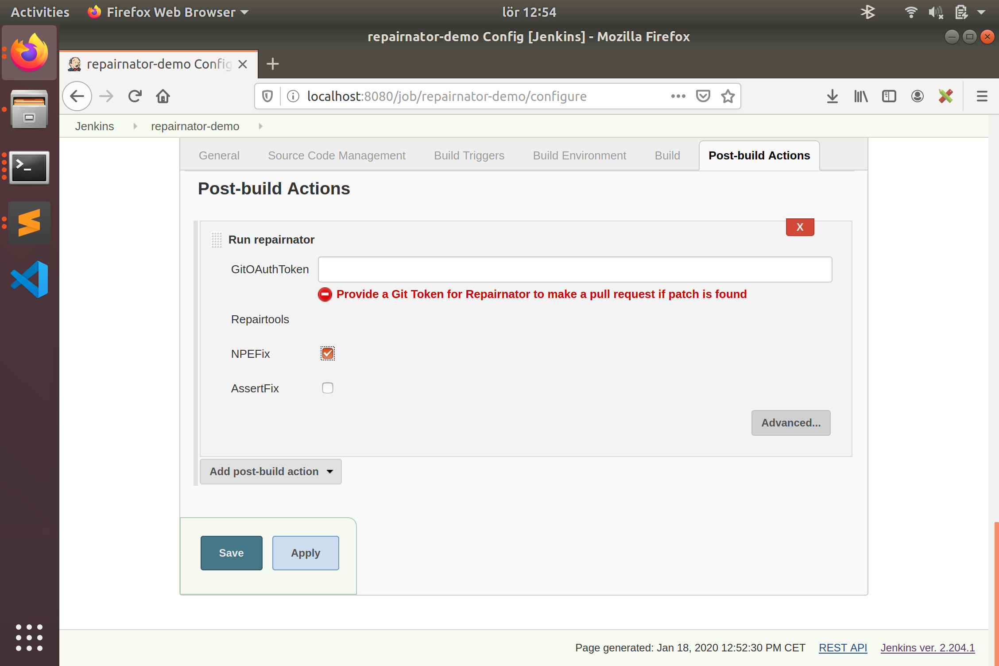
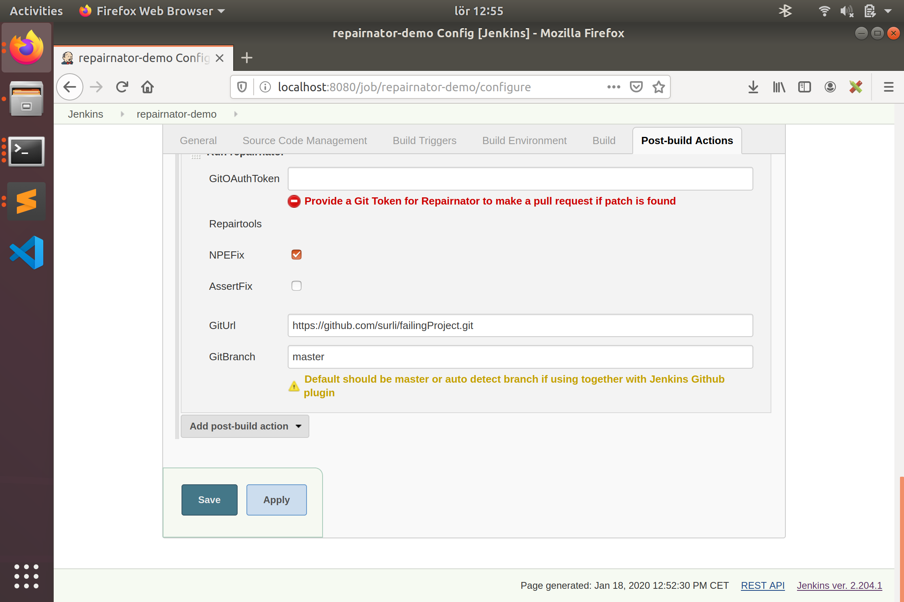

# Repairnator Jenkins Plugin

The Repairnator Jenkins Plugin can be used:

1. to run Repairnator on each failing build on Jenkins
2. to automatically create pull-requests on Github when a patch is found by one of the repair tools.
 
## How to install repairnator-jenkins-plugin?

**Download** You can download the Jenkins `hpi` file from our snapshot repo at <https://repo.jenkins-ci.org/snapshots/fr/inria/repairnator/repairnator-jenkins-plugin/> 


* On Jenkins, go to `Manage Jenkins -> Manage Plugins -> Advanced`.
* In the `Upload plugin` section, upload the `hpi` file
* Restart the server when done

## How to use the plugin repairnator-jenkins-plugin?

### Freestyle jobs.

* Install plugin `Github Pull Request builder`,[link](https://wiki.jenkins.io/display/JENKINS/GitHub+pull+request+builder+plugin) and activate build upon git pull request. 

* Add `run repairnator` as post build action



* Choose the repair tool. The default tool is [`NPEFix`](https://hal.archives-ouvertes.fr/hal-01419861/document). See [this page](https://github.com/eclipse/repairnator/blob/master/doc/repair-tools.md) for more information about wht tool can do. 

* For repairnator to make a PR back to the repo when patches are found, provide a valid github token.



* Note: When using repairnator together with GitHub PR builder, the advanced option panel can be left empty (the repairnator plugin guesses the Git URL and branch from the SCM information in the freestyle job). 

That's it, if you have a failing build for which Repairnator is able to find a patch (approx. 1/1000 builds), you'll have a pull request for it.

### Advanced config

If you don't use a Github build or a pull-request build, you must specify the Git Url and Git branch by expanding the `advanced` menu.




Also, to activate Repairnator only upon build failures, use a plugin `flexible publish pluggin` [(link)](https://wiki.jenkins.io/display/JENKINS/Flexible+Publish+Plugin) and a condition "on failing build".

## Contributor corner

### Direct compilation

```
cd src/repairnator-jenkins-plugin
mvn install -DskipTests
```

The hpi is put in the `target/` folder. 

### Architecture Overview (for plugin developers)

The general workflow of the plugin itself is like this, html page (from `.jelly` code) -> plugin get values from form fields -> Error check , if nothing wrong create a `RunPipelineAction` class to run the pipeline with `JenkinsLauncher` class as a special entry point for repairnator when using in Jenkins context.  


Repairnator Jenkins plugin imports the `repairnator-pipeline` code as a maven dependency, so most of the features of the pipeline can be reused without any big change. 

