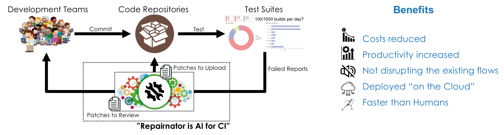
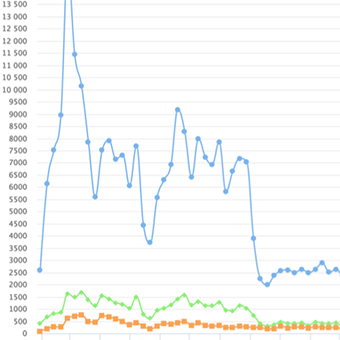
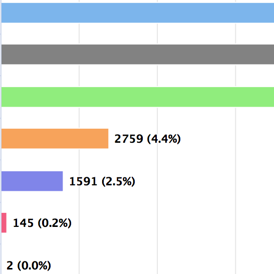

## Repairnator: AI for Continuous Integration

Repairnator is a software development robot that automatically repairs build failures on Continuous Integration (CI) flows. It monitors failing software builds, tries to locally reproduce these failings and finally attempts to repair them with the state-of-the-art of <a href="https://softwarediversity.eu/">automated program repair research</a>.

 

 

 

## About Repairnator

### Press & Medium

<table summary="" cellpadding="10" cellspacing="10" >
<tr>
<td>

&nbsp;

 

</td>
<td>

<a href="https://www.theregister.co.uk/2018/10/17/luc_esape_bug_fixer/">The mysterious life of Luc Esape, bug fixer extraordinaire. His big secret? He’s not human</a>
 
The Register, Oct. 2018</a>

</td>
</tr>

<tr>
<td>

&nbsp;

 

</td>
<td>

<a href="https://www.inria.fr/en/centre/lille/news/repairnator-an-autonomous-robot-to-repair-computer-bugs">Repairnator, an autonomous robot to repair computer bugs</a>
 
inria.fr, Sep. 2018

</td>
</tr>

<tr>
<td>

&nbsp;

 

</td>
<td>

<a href="https://medium.com/@martin.monperrus/human-competitive-patches-in-automatic-program-repair-with-repairnator-359042e00f6a">Human-competitive Patches in Automatic Program Repair with Repairnator</a>
 
Medium, Oct. 2018

</td>
</tr>

</table>

### For Developers (and more info)

<table summary="" cellpadding="10" cellspacing="10" >
<tr>
<td>

&nbsp;

 

</td>
<td>

<a href="https://github.com/Spirals-Team/repairnator/">Github Repository</a>

</td>
</tr>

</table>

### Academic Paper

<table summary="" cellpadding="10" cellspacing="10" >
<tr>
<td>

&nbsp;

 

</td>
<td>

<a href="https://hal.inria.fr/hal-01691496/document">How to Design a Program Repair Bot?
Insights from the Repairnator Project</a>

</td>
</tr>

</table>

 

## What Is Repairnator Doing Right Now?

<table summary="" cellpadding="10" cellspacing="10" >
<tr>
<td>

&nbsp;

 

</td>
<td>

<a href="http://repairnator.proj.kth.se">Check our Robot's Online Health Status</a>

</td>
</tr>

</table>

 

## Contact

<table summary="" cellpadding="10" cellspacing="10">
<tr>
<td>

&nbsp;

 

</td>
<td>

<a href="https://www.monperrus.net/martin/"><h4>Martin Monperrus</h4></a>

martin.monperrus@csc.kth.se

</td>
</tr>

<tr>
<td>

&nbsp;

 

</td>
<td>
<a href="https://www.linkedin.com/in/fredericloiret/"><h4>Frédéric Loiret</h4></a>

loiret@kth.se

</td>
</tr>

<tr>
<td>

&nbsp;

 

</td>
<td>
<a href="https://softwarediversity.eu"><h4>Benoit Baudry</h4></a>

baudry@kth.se

</td>
</tr>

</table>

