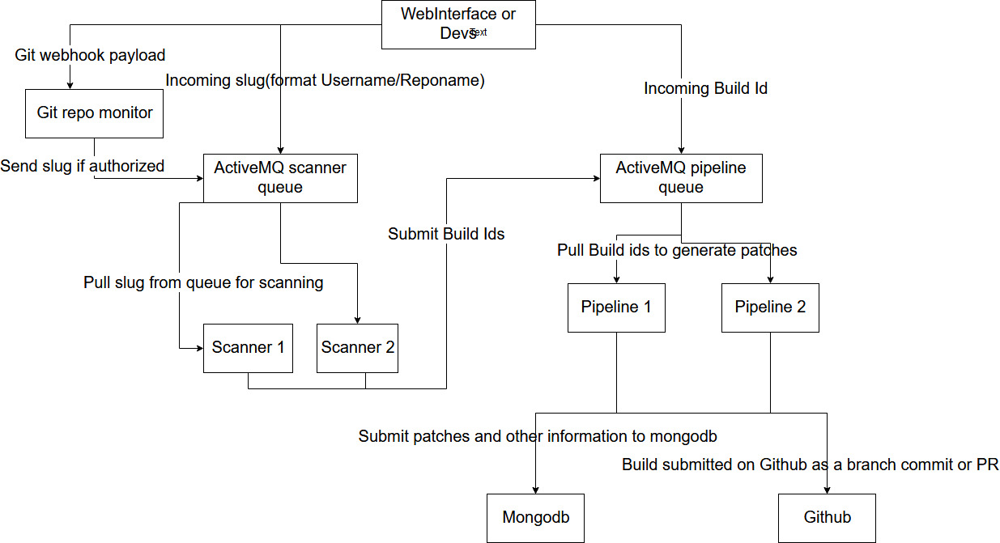
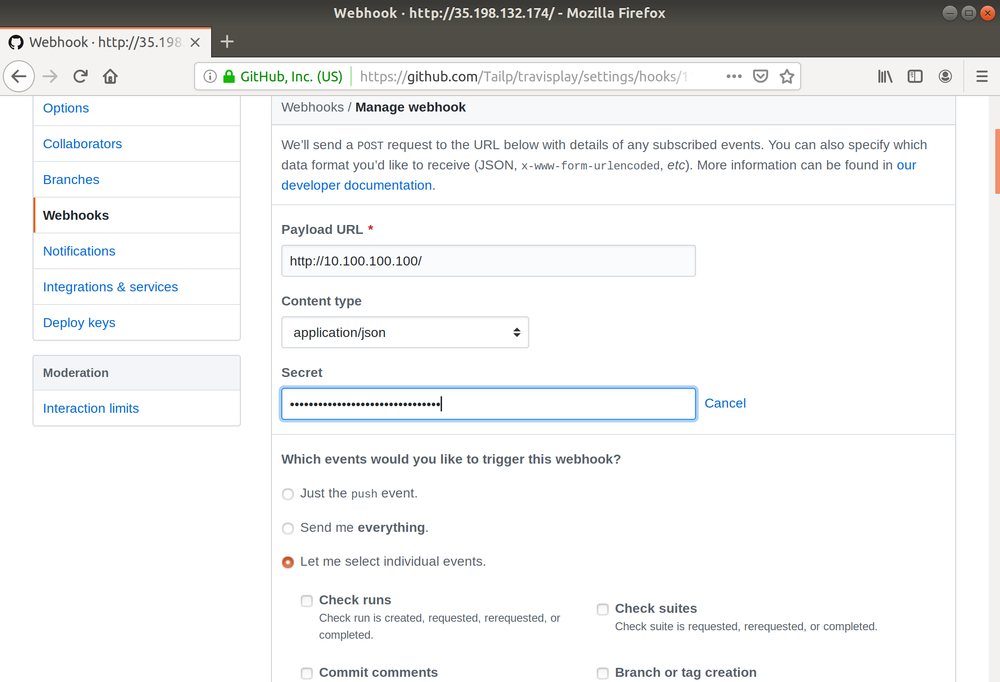

# Deploy Repairnator in Kubernetes
Note: to store data you can either deploy activeMQ on cloud described at the bottom of this README or if you have a mongodb outside the cluster you can map it as an external service named as mongo (since all of the default mongo k8s service name is named "mongo" if you don't like a lot changes). More details for how this is done is described in [this link](ttps://cloud.google.com/blog/products/gcp/kubernetes-best-practices-mapping-external-services)



## Prerequisites

* kubectl
* a working k8s cluster (preferable high cpu capacity)
* gcloud (for creating the cluster mentoned above and creating mongodb if you don't have them already)

The starting folder for these deployment below is "repairnator/kubernetes-support".
## Setup ActiveMQ

To deploy ActiveMQ for effective queue managements of jobs to the pipeline and scanner. First apply the yaml file inside the queue-for-buildids folder
```
	kubectl create -f /queue-for-buildids/activemq.yaml
```
To access to the web interface
```
	kubectl get pods 
```
It should look like activemq-XXXXXXX-XXXXX. Then 
```
	kubectl exec -it activemq-XXXXXXX-XXXXX bash
```
To expose to localhost for webinterface access and also publishing(sending message to queue) outside the cluster. 
```
	kubectl port-forward activemq-XXXXXXX-XXXXX 8161:8161 61613:61613
```
Access webinterface with "http://localhost:8161/admin/" in your browser. The default username is "admin" and password is also "admin".

To send message to queue use the publisher.py script in queue-for-buildids folder. Syntax
```
	python publisher.py -d queue-name message-1 message-2 message3 ... message-N
```

queue-name is according to the format /queue/name. For instance /queue/scanner will send message to the scanner queue.
You can use this later to manually input build id to the pipeline queue or project to the scanner queue

## Setup scanners and pipelines

To deploy the scanner first go into folder "scanner-dockerimage" then directly build and push the image to docker hub(enviroment variables can be specified or changed later in the "repairnator-scanner.yaml" file. With docker 
```
	docker build -t repairnator-scanner:tagname .
	docker tag repairnator-scanner:tagname YOUR_DOCKERHUB_NAME/repairnator-scanner
	docker push YOUR_DOCKERHUB_NAME/repairnator-scanner:tagname
```
Then go to "repairnator-deployment-yamlfiles" folder. Open repairnator-scanner.yaml then replace the image 

```
...
	containers:
      - name: repairnator-scanner
        image: YOUR_DOCKERHUB_NAME/repairnator-scanner:tagname
...
```

Now create the scanner with 
```
	kubectl create -f repairnator-scanner.yaml
```
Then go to "http://localhost:8161/admin/queues.jsp" and you should see a scanner queue with one consumer.

Same goes for the pipeline, first go to "pipeline-dockerimage docker build and push it and modify the yaml file then fill in env values in the "repairnator-pipeline.yaml" file , then create with kubectl and you should also see on the same page a pipeline queue with one consumer.

## Example run
In the folder "queue-for-buildids" use publisher.py to send messages to the queue. If you have a slug (like "surli/failingProject") you can send it to the scanner queue for scanning. The scanner will auto submit the interesting BuildIds to the pipeline queue for generating patches. So sending by
```
	python publisher.py /queue/scanner surli/failingProject
```
This will give some patches to the pipeline and you can confirm that by checking at the webpage for message enqueued. Then you can also see that in the pipeline pod. 
```
	kubectl get pods
```
You should see something like repairnator-scanner-XXXXXXXXX-XXXXX . Watch the output of the scanner by(in realtime with flag -f)
```
	kubectl logs repairnator-scanner-XXXXXXXXX-XXXXX
```
Also for the pipeline if there are some interesting build gotten from the scanner you will be able to see it with 
```
	kubectl logs repairnator-pipeline-XXXXXXXXX-XXXXX
```
The output of the pipeline such as patches, hardwareinfo .. is submitted to the cloud mongodb just like the non-cloud repairnator.

To scale this either you can change the "replicas" value in the yaml file and reapply the yaml or scale it with kubectl
```
	kubectl scale --replicas=3 -f repairnator-pipeline.yaml
```
This will create 2 more pipelines and you should be able to see it "http://localhost:8161/admin/queues.jsp" . Same thing with the scanner if you need more than one like for instance if there are too many jobs in the queue.

## Setup repo monitor
The idea with this monitor is that it first check any incoming github webhook if it's authorized to be scanned or not before sending a message to the scanner queue to scan the repo mentioned in the github-payload. To security-check incomming message it will fetch credentials information stored in the database mongodb deployed previously , then it doublechecks it will the accompied hash SHA1 also in the incomming webhook payload. This means that the one sended need to be registered in MongoDB to be able to use this feature. An example to add a register a user is first go to the database by 
```
	kubectl get pods
	kubectl exec -it activemq-XXXXXXX-XXXXX bash
	mongo
```
Then we need to create a database called "githook" (note that it must be named like this according to the script if you don't plan to change it) and insert some information into a collection called "gitSecrets". These are done by these steps below.
```
	use githook
	db.gitSecrets.insert({{"slugName" : "Spirals-Team/repairnator", "gitSecret" : "123456789"}})
```
Next is deploying the repo monitor itself on K8s. First you need to go to the "repomonitor-dockerimage" to build and push an image to docker just like how we did with the scanner. Then there is also a yaml file in "repairnator-deployment-yamlfiles" folder for deploying and also here we need to replace in the "repo-monitor.yaml" file the name of your image you tagged before when pushing to docker (format DOCKER_USER_NAME/IMAGE_NAME). Then apply the yaml 
```
	kubectl create -f repo-monitor.yaml
```
This will create a pod named "repo-monitor-XXXXXXXX-XXXX" together with a service creating a Loadbalancer with an external address for github. We need to fetch this address by this command 
```
	kubectl get svc 
```
and look for a service named "repo-monitor" then take its external IP (it usually takes a while before the LoadBalancer finish setting up).
Then go to your repo github page -> setting -> webhook -> add new webhook and then add the Payload URL" as "http://LoadBalancer_IP/" shown in the picture below, "Content type" is set as "application/json" then secret is the "gitSecret" previously added to the database "123456789" (Note: this should be a hash of some kind like a MD5 hash to be safer) then also select "Let me select individual events" to scroll down a bit to select "Statuses". The reason we choose only sending status update is because the server is set to only activate the pipeline when the build status is failure.


Now back to the terminal. We can check the logs of our repo-monitor deployed earlier by first 
```
	kubectl logs -f repo-monitor-XXXXXXXX-XXXX
```
You should be able to see something like
```
Listening on port 30050!
Authorized
Sending scan request for slug Spirals-Team/repairnator
```
Same logic apply for any repo want to be monitored. First register the slug in database with a secret then add a webhook like mentioned before then we are done. 


## Setup Mongodb (optional)

First set up mongodb on kubernetes with a persistent memory volume(PVC)(This mean that even if you erase the deployment and redeploy nothing will be lost, the database would look the same)

```
	gcloud compute disks create --size=200GB --zone=$ZONE mongo-disk
```
Then create the mongodb deployemnt using mongodb.yaml in the k8s-mongodb folder .

```
	kubectl create -f k8s-mongodb/mongodb.yaml
```
Try it out
```
	kubectl get pods 
```
Our mongodb pod should be named like "mongo-controller-XXXXX" then we can get into the pod 
```
	kubectl exec -it mongo-controller-XXXXX bash
	mongo
```


## Delete deployment
Provided with every yaml files mentioned in this readme (all of them are in "repairnator-deployment-yamlfile" folder), call 
```
	kubectl delete -f "yamlfile" 
```
To remove each of them. For instance kubectl delete -f repairnator-scanner.yaml to remove the scanners. 


